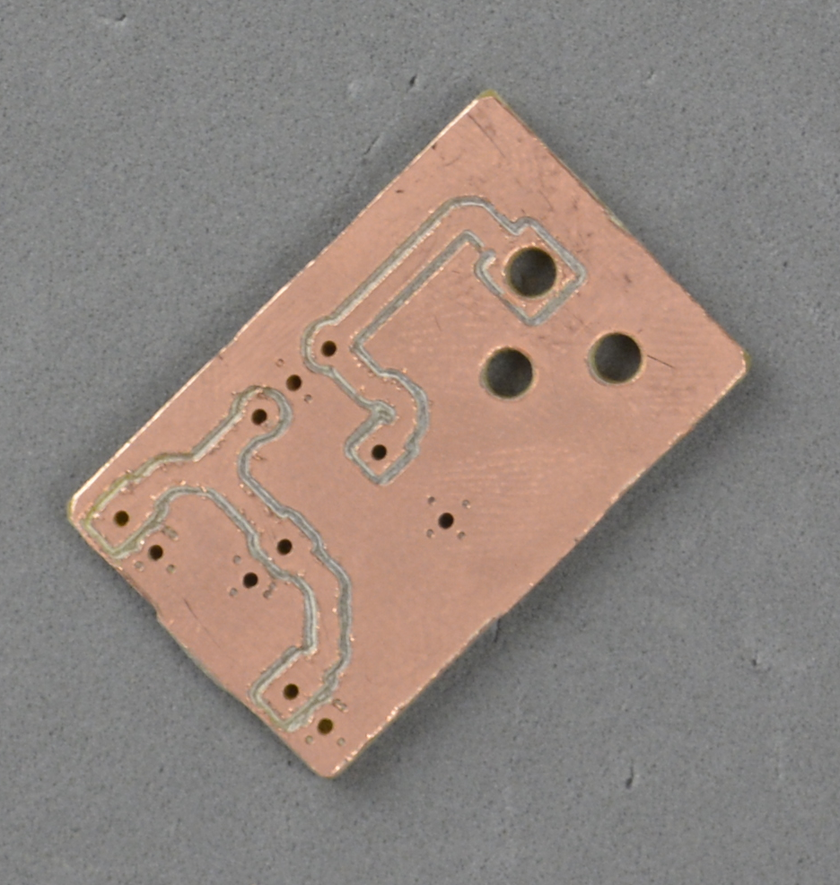
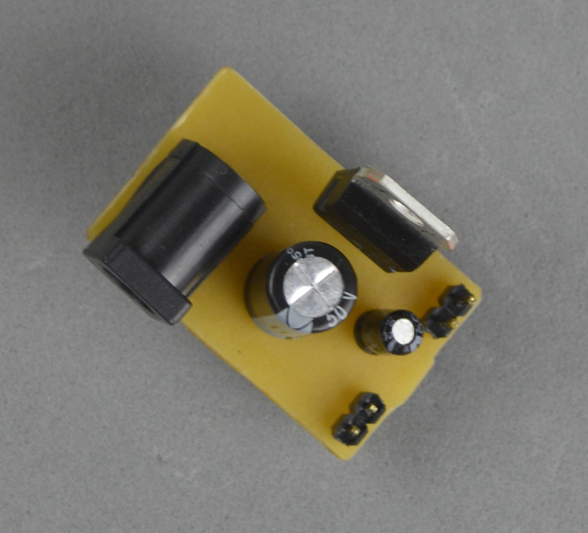

#BreadBoard Power Supply

Works with center positive DC supply.

Uses L7805 module and capacitors to smooth signal. Maybe you need to attach a power sink to it.

**(Avoid to touch it, anyway)**

###PCB

I've milled the board, but I'm sure it will work with PCB Insulation too.

You will find schematics, pcb design files, gerbers and gcode inside PCB folder.

I've milled with a 60 degrees V drill (deep=0.15mm/diameter=0,52mm).

##Pictures

* Before soldering:

* After soldering:

